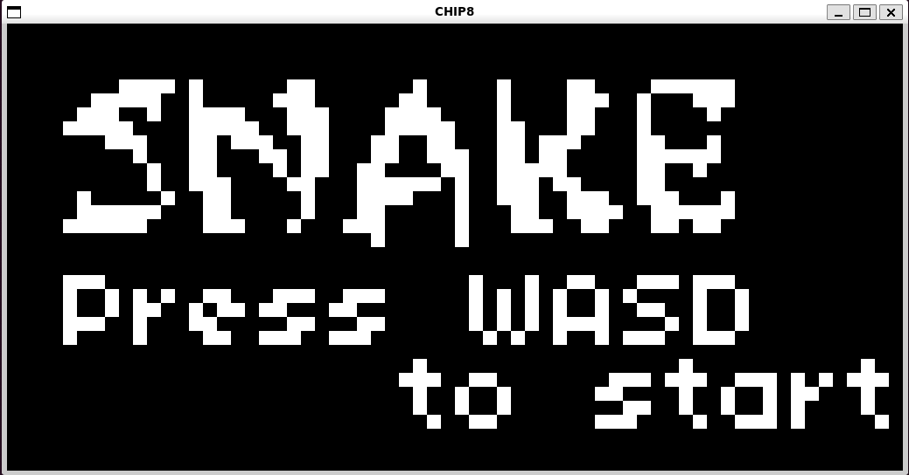

# Chip8




This is a CHIP8 interpreter written in C++. It runs games that use the CHIP8 instruction set.

CHIP8 is an assembly-like programming language that typically runs on a virtual machine.
It was created in the 70s and became popular for running small retro games.
Check out the [Wikipedia page](https://en.wikipedia.org/wiki/CHIP-8) for more information.
If you want to build your own CHIP8 interpreter, I recommend [this guide](https://austinmorlan.com/posts/chip8_emulator/) by Austin Morlan.
To download Chip8 games, head to [this archive](https://johnearnest.github.io/chip8Archive/) compiled and mantained by John Earnest.

## Usage
```
$ chip8 my_game.ch8
```

## Dependencies
* CMake: build system. See https://cmake.org/
* SFML: graphics library. See https://www.sfml-dev.org/
* Catch2: C++ test framework. See https://github.com/catchorg/Catch2

## How to build
Clone the repository
```
git clone https://github.com/jorgefz/chip8
cd chip8
```

Generate the Makefiles and compile the interpreter
```
cmake -S . -B build
make -C build chip8
```

Call the interpreter with a game of your choice
```
./build/chip8 my_game.ch8
```